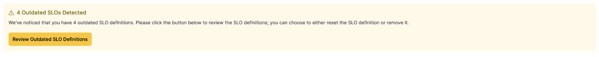

## Elastic Observability -  SLO feature upgrade helper (8.11.x -> 8.12.0)

_If you're on version 8.11.x using our Elastic Observability SLOs feature and want to upgrade to the 8.12.0 version, this tool is designed to assist you._

The recent modifications to our transforms have introduced a breaking change. To ensure greater robustness, we've implemented a new set of APIs and UI to manage SLO definitions, offering upgrades and resets. Following the upgrade, upon loading the SLO page, a notification banner will appear, alerting you about the presence of 'Outdated SLOs'.


This code essentially resets all the configured SLOs, sparing you the need to reset them individually.

### Usage

Export the following environment variables:
- `export ES_USERNAME=<your-es-user>`
- `export ES_PASSWORD=<password>`
- `export KIBANA_ENDPOINT=<kibana-url>` (make sure to add only the name, if the URL is https://slo-test-44.kb.us-west2.gcp.elastic-cloud.com:9243/), the value of the environment variable should be: `slo-test-44.kb.us-west2.gcp.elastic-cloud.com`)
- `export KIBANA_PORT=<port>` (if you don't specify it, 9243 will be used)
- `export KIBANA_SPACE_NAMES="default"` (in case you have more Kibana spaces, specify it in this list (eg, "default, space1, space2")

Running the code `python slo_upgrade_helper.py`:
```
Outdated SLOs found in Space 'space1': 1
space1 - slo1
Reset SLO ID cb6dbf60-afb6-11ee-aa14-41a0143c7520 in Space 'space1': 200 - {"name":"space1 - slo1","description":"","indicator":{"type":"sli.kql.custom","params":{"index":"kibana_sample_data_logs","filter":"","good":"response: 200","total":"response: * ","timestampField":"@timestamp"}},"budgetingMethod":"occurrences","timeWindow":{"duration":"30d","type":"rolling"},"objective":{"target":0.99},"tags":[],"groupBy":"*","id":"cb6dbf60-afb6-11ee-aa14-41a0143c7520","settings":{"syncDelay":"1m","frequency":"1m"},"revision":1,"enabled":true,"createdAt":"2024-01-10T12:50:12.694Z","updatedAt":"2024-01-10T13:34:29.416Z","version":2}
Outdated SLOs found in Space 'default': 1
default - slo01
Reset SLO ID 913bd430-afb6-11ee-aa14-41a0143c7520 in Space 'default': 200 - {"name":"default - slo01","description":"","indicator":{"type":"sli.kql.custom","params":{"index":"kibana_sample_data_logs","filter":"","good":"response: 200","total":"response: * ","timestampField":"@timestamp"}},"budgetingMethod":"occurrences","timeWindow":{"duration":"30d","type":"rolling"},"objective":{"target":0.99},"tags":[],"groupBy":"*","id":"913bd430-afb6-11ee-aa14-41a0143c7520","settings":{"syncDelay":"1m","frequency":"1m"},"revision":1,"enabled":true,"createdAt":"2024-01-10T12:48:35.059Z","updatedAt":"2024-01-10T13:34:31.520Z","version":2}
```

### Docker

If you wish, you can also use Docker to achieve the same. First, pull the image `docker pull docker.elastic.co/observability/slo-upgrade-helper:1.0`.

And run the container:
`docker run --env ES_USERNAME="<username>" --env ES_PASSWORD="<password>" --env KIBANA_ENDPOINT="<kb-endpoint>" --env KIBANA_SPACE_NAMES="default,space1" docker.elastic.co/observability/slo-upgrade-helper:1.0`

Following this, you should no longer encounter Outdated SLO notifications, allowing you to seamlessly resume using the SLOs and benefit from the enhancements in the 8.12.0.

Happy SLO!
